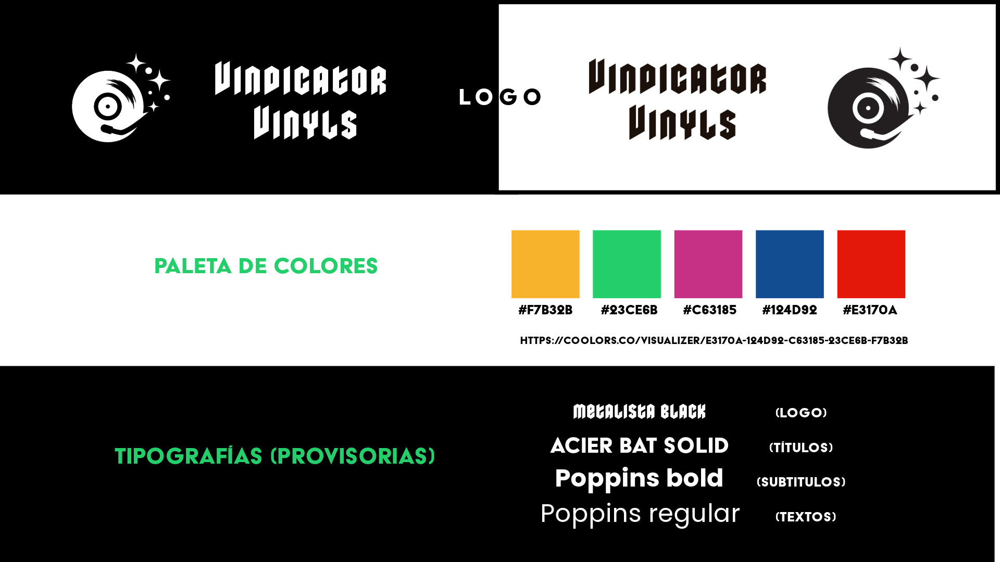

# Vindicator Vinyls

## Descripción del E-commerce.
**Vindicator Vinyls** es una plataforma de venta de discos de vinilo de diversos géneros, artistas y épocas. Está diseñada para satisfacer las necesidades y preferencias de los coleccionistas y aficionados al vinilo de todo el país. El sitio web está orientado a tener una estética algo indie, más no por eso menos elegante o profesional. 

## Qué ofrecemos
Nuestra tienda se encarga de la venta de discos de pasta. Este es un medio de almacenamiento analógico de señales sonoras, caracterizado por utilizar como material de soporte un plástico denominado policloruro de vinilo. Por esta razón también se los conoce como discos de vinilo. Presentan una mayor calidad de sonido que los medios digitales, y por eso varias bandas musicales siempre lanzan algunos de sus álbumes en este formato.

## Nuestro público objetivo.
Nuestro público objetivo serán aquellos melómanos que posean un tocadiscos, o simples coleccionistas que amen demasiado a una banda como para comprar sus vinilos aun sin tener un tocadiscos. Teniendo en cuenta que la colección de discos de vinilo es un lujo, se podría decir que los precios reflejarán eso.

## Quiénes somos
Anabel Alvarado y Nelson Bravo.

## Sitios de referencia: 

1. [Cyber Wak](https://cyberwax.com.ar): es una tienda online de discos de vinilo de Argentina y nos llamó la atención su estética y paleta de colores.
2. [Vinyl Me, Please](https://www.vinylmeplease.com/): además de la venta de vinilos, ofrece mucho contenido interesante y una navegación fluida, con animaciones sutiles y bien organizada.
3. [Discogs](https://www.discogs.com/es/): es una plataforma muy completa para los amantes de vinilos a nivel global.
4. [Exiles Records](https://www.exilesrecords.com): tiene un diseño bastante simple pero nos puede orientar a la hora de simplificar el armado de nuestra tienda.
5. [The Record Hub](https://therecordhub.com/): destacamos la organización y estética del sitio.

## Nuestro Tablero de trabajo:
-Nos organizamos con [Trello](https://trello.com/b/Bbqf0Me9/dh-grupo-3): se encuentra público para su revisión.

## Wireframes:

**Guía de branding del sitio**

**Wireframes Mobile**

**Wireframes Desktop**

